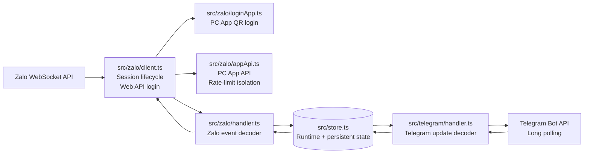
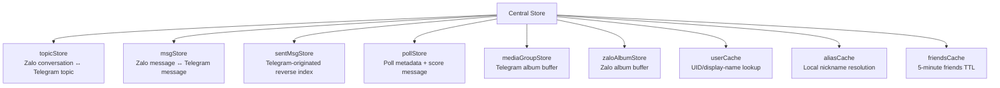
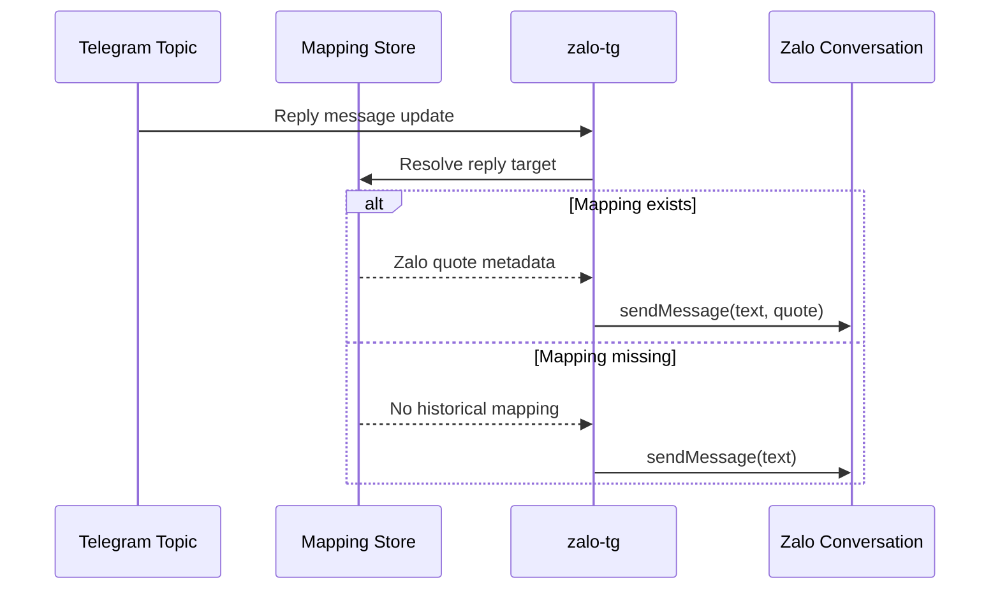
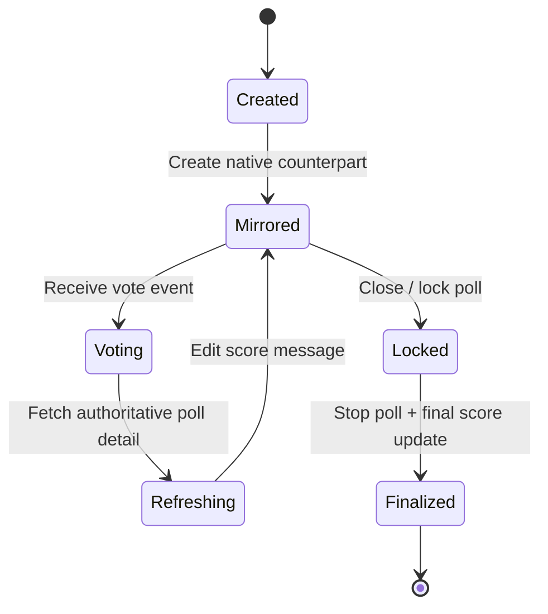
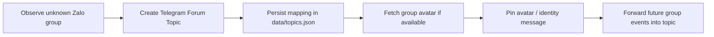

<div align="center">

# ⚡ zalo-tg

### A production-oriented, stateful interoperability bridge between **Zalo** and **Telegram**

`zalo-tg` transforms Telegram Forum Topics into a structured operational console for Zalo conversations, while preserving message identity, media semantics, replies, reactions, recalls, mentions, polls, and long-lived conversation state.

<br />

[](#)
[](#requirements)
[](#architecture)
[](#zalo-authentication)
[](#license)

<br />

[Overview](#-system-overview) •
[Architecture](#-architecture) •
[Features](#-capability-surface) •
[Installation](#-installation) •
[Configuration](#-configuration) •
[Commands](#-bot-command-surface) •
[Security](#-security-model)

<br />

<details>
  <summary><b>📖 Documentation Menu</b></summary>
  <ul align="left">
    <li><a href="README.md">Home (README)</a></li>
    <li><a href="USER_GUIDE.md">User Guide</a></li>
    <li><a href="LOCAL_BOT_API_SETUP.md">Local Bot API Setup</a></li>
    <li><a href="DEPLOY_HOME_SERVER.md">Home Server Deployment</a></li>
    <li><a href="quick-start-script/GUIDE%20automation.md">Mac Quick Start - Automator</a></li>
    <li><a href="quick-start-script/GUIDE%20command.md">Mac Quick Start - Command</a></li>
  </ul>
</details>

<!-- Upstream Additions below -->

- Node.js `>=20.11`
- npm
- Git (required for the curl installer and update flow)
- Optional: Go `>=1.24` to build the Charmbracelet TUI sidecar
- A Telegram bot token
- A Telegram supergroup with forum topics enabled
- The bot must be admin in that Telegram group
- A Zalo account that can scan QR login
- Optional: Docker / Docker Compose for the local Bot API setup

<br>
<strong>English</strong> | <a href="README.vi.md">Tiếng Việt</a>
</div>

---

## 📌 Table of Contents

- [System Overview](#-system-overview)
- [Architectural Principles](#-architectural-principles)
- [Architecture](#-architecture)
- [Capability Surface](#-capability-surface)
- [Message Compatibility Matrix](#-message-compatibility-matrix)
- [Interaction Synchronisation](#-interaction-synchronisation)
- [Poll Synchronisation](#-poll-synchronisation)
- [Group and Topic Lifecycle](#-group-and-topic-lifecycle)
- [Requirements](#-requirements)
- [Installation](#-installation)
- [Quick Start — macOS](#-quick-start--macos)
- [Configuration](#-configuration)
- [Running the Bridge](#-running-the-bridge)
- [Zalo Authentication](#-zalo-authentication)
- [Large File Transfer](#-large-file-transfer--20-mb)
- [Bot Command Surface](#-bot-command-surface)
- [Project Structure](#-project-structure)
- [Persistent Data Model](#-persistent-data-model)
- [Security Model](#-security-model)
- [Contributors](#-contributors)
- [License](#-license)

---

## 🧭 System Overview

`zalo-tg` is a **bidirectional, state-aware synchronisation layer** that connects the Zalo messaging ecosystem with Telegram through a Telegram bot. Each Zalo conversation—either a direct message or a group conversation—is deterministically represented as an isolated **Telegram Forum Topic** inside a configured Telegram supergroup.

Unlike a conventional relay bot that merely forwards text payloads, this project implements a richer interoperability model. It maintains cross-platform message correlation, reconstructs reply chains, translates media objects, mirrors selected interaction primitives, resolves mentions and aliases, and coordinates poll state between two messaging platforms with fundamentally different event models.

> [!IMPORTANT]
> `zalo-tg` is designed as an operational bridge, not a stateless message forwarder. Its correctness depends on persisted topic mappings, runtime message indexes, session material, and careful event translation across Zalo and Telegram.

### High-level Behaviour

| Domain | Behaviour |
|---|---|
| Conversation mapping | Each Zalo thread maps to one Telegram Forum Topic. |
| Inbound Zalo events | Zalo messages are decoded, normalised, enriched, then emitted to Telegram. |
| Inbound Telegram updates | Telegram messages are interpreted, transformed, uploaded, then delivered to Zalo. |
| Message identity | Zalo and Telegram message identifiers are indexed bidirectionally. |
| Context preservation | Replies, recalls, reactions, mentions, media albums, and poll updates are reconstructed when enough metadata is available. |
| Failure posture | Missing historical mappings degrade gracefully instead of breaking the forwarding pipeline. |

---

## 🧠 Architectural Principles

`zalo-tg` is built around a few core engineering principles:

<table>
<tr>
<td width="33%">

### 🧩 Semantic Preservation

The bridge attempts to preserve the *meaning* of messages, not only their raw textual content. Attachments, replies, mentions, reactions, locations, contacts, and polls are translated into the closest platform-native representation.

</td>
<td width="33%">

### 🔁 Bidirectional Correlation

Every supported event direction maintains a correlation layer between Zalo message identifiers and Telegram message identifiers, enabling reply resolution, recall propagation, and contextual reconstruction.

</td>
<td width="33%">

### 🛡️ Graceful Degradation

When a mapping, media object, quote target, or metadata fragment cannot be resolved, the system continues forwarding the message while omitting only the unavailable semantic layer.

</td>
</tr>
</table>

---

## 🏗️ Architecture

The bridge executes as a single long-lived **Node.js** process. It maintains two concurrently active client layers:

1. A **Telegram Bot API client**, implemented with [`Telegraf`](https://github.com/telegraf/telegraf), using long polling.
2. A **Zalo client**, implemented with [`zca-js`](https://github.com/RFS-ADRENO/zca-js), connected to Zalo's internal WebSocket interface.

Both clients communicate through shared runtime stores and persisted metadata. These stores act as the correlation substrate required to translate stateful message semantics between the two platforms.



### Runtime State Plane



### State Model

The topic mapping is persisted in `data/topics.json`, ensuring that known Zalo conversations remain attached to stable Telegram Forum Topics across process restarts.

Message-ID mappings are primarily maintained in memory with LRU-style eviction. A compressed persisted mapping file, `data/msg-map.json`, allows reply-chain resolution to survive restarts. If a historical mapping is unavailable, the system deliberately degrades by omitting Telegram `reply_parameters` or Zalo quote metadata rather than failing the forwarding operation.

---

## ✨ Capability Surface

| Capability | Status | Technical Notes |
|---|:---:|---|
| Bidirectional message forwarding | ✅ | Zalo ⇄ Telegram event projection. |
| Forum Topic provisioning | ✅ | Automatic topic creation per Zalo conversation. |
| Rich media forwarding | ✅ | Photos, albums, videos, GIFs, files, stickers, voice notes, contacts, locations, and selected web content. |
| Reply-chain preservation | ✅ | Requires available message correlation metadata. |
| Reaction propagation | ✅ | Emoji compatibility mapping and contextual fallback messages. |
| Message recall | ✅ | Zalo undo → Telegram deletion; Telegram `/recall` → Zalo undo. |
| Poll synchronisation | ✅ | Native polls, score messages, vote propagation, and lock handling. |
| Mention resolution | ✅ | Display names, Telegram usernames, Zalo UIDs, and aliases. |
| Rate-limit mitigation | ✅ | Optional PC App API session for selected lookup paths. |
| Large file transfer | ✅ | Optional local Telegram Bot API server, up to 2 GB. |

---

## 🧾 Message Compatibility Matrix

### Zalo → Telegram

| Zalo message type | Telegram representation | Notes |
|---|---|---|
| `webchat` | `sendMessage` | HTML parse mode; Zalo mentions are rendered safely. |
| `chat.photo` | `sendPhoto` / `sendMediaGroup` | Albums are buffered for 600 ms before emission. |
| `chat.video.msg` | `sendVideo` | Preserves native video representation. |
| `chat.gif` | `sendAnimation` | Uses Telegram animation semantics. |
| `share.file` | `sendDocument` | Retains the original filename. |
| `chat.voice` | `sendVoice` | Preserves voice-note UX. |
| `chat.sticker` | `sendSticker` / `sendPhoto` | WebP sticker path with photo fallback for oversized assets. |
| `chat.doodle` | `sendPhoto` | Rendered as an image asset. |
| `chat.recommended` | `sendMessage` | Inline link preview. |
| `chat.location.new` | `sendLocation` | Telegram native map widget. |
| `chat.webcontent` — bank card | `sendPhoto` | VietQR image plus account metadata. |
| `chat.webcontent` — generic | `sendMessage` | Icon and label metadata. |
| Contact card | `sendPhoto` / text fallback | QR code, name, and ID when available. |
| `group.poll` — create | `sendPoll` + score message | Includes editable score message and inline lock control. |
| `group.poll` — vote update | Score-message edit | Updated counts with compact bar visualization. |

### Telegram → Zalo

| Telegram content | Zalo operation | Notes |
|---|---|---|
| Text | `sendMessage` | Includes mention-resolution pipeline. |
| Single photo | `sendMessage` with image attachment | Caption participates in mention resolution. |
| Photo album | `sendMessage` with multiple attachments | Albums are buffered for 500 ms. |
| Single video | `sendMessage` with video attachment | Native attachment upload. |
| Video album | `sendMessage` with multiple attachments | Buffered media-group handling. |
| Animation / GIF | `sendMessage` with attachment | Download and upload pipeline. |
| Document | `sendMessage` with attachment | Preserves document payload. |
| Voice note | `sendVoice` | Converts OGG Opus to M4A through `ffmpeg`. |
| Static WebP sticker | `sendMessage` with attachment | Static sticker forwarding. |
| Animated/video sticker | Thumbnail attachment | JPEG thumbnail fallback. |
| Location | `sendLink` / `sendMessage` fallback | Google Maps URL bridge. |
| Contact | `sendMessage` | Name and phone number serialization. |
| Poll | `createPoll` | Also creates a bot-owned non-anonymous Telegram clone poll for vote tracking. |

---

## 🔄 Interaction Synchronisation

### Reply Chains

When a Telegram message replies to another Telegram message, the bridge attempts to resolve the target message back to a Zalo-compatible quote object. That quote metadata is then passed to `sendMessage`, allowing the forwarded Zalo message to retain conversational context.

For messages originally sent from Telegram to Zalo, the reverse lookup is performed through `sentMsgStore`, ensuring that replies remain coherent even when the original message did not originate from Zalo.



### Reactions

Telegram `message_reaction` updates are mapped through a static emoji compatibility table and forwarded to Zalo with `addReaction`. In the opposite direction, Zalo reactions are represented in Telegram as concise contextual replies so that reaction activity remains visible even when Telegram lacks a one-to-one representation for the source event.

### Message Recall

Zalo `undo` events are mirrored by deleting the corresponding Telegram message when a mapping exists. On the Telegram side, the `/recall` command invokes `api.undo` for messages previously sent by the bot into Zalo.

### Mentions and Aliases

Zalo `@mention` spans are rendered on Telegram with safe HTML formatting. Telegram `@username` entities and plain-text `@Name` patterns are resolved to Zalo UIDs through `userCache`.

The bridge also supports Zalo contact aliases. If a Zalo user has a local nickname configured in the address book, `@Alias` can resolve to the correct UID even when the visible display name differs. Captions attached to photos, videos, and documents participate in the same mention-resolution pipeline.

---

## 🗳️ Poll Synchronisation

Poll synchronisation is implemented as a coordinated state machine rather than a naive forwarding rule. This is necessary because Zalo and Telegram expose materially different poll models, authoring constraints, and vote-update events.



Supported flows:

| Flow | Implementation |
|---|---|
| Zalo poll creation → Telegram | Creates a native Telegram poll and an editable score message. |
| Telegram poll creation → Zalo | Calls Zalo `createPoll` and creates a bot-owned Telegram clone poll. |
| Telegram `poll_answer` → Zalo | Calls Zalo `votePoll`, then refreshes score state through `getPollDetail`. |
| Zalo vote event → Telegram | Handles `group_event` with `boardType=3`, then edits the score message. |
| Poll closure | Calls Zalo `lockPoll`, Telegram `stopPoll`, and final score-message update. |

> [!NOTE]
> The bot-owned clone poll is required because Telegram only emits `poll_answer` updates for polls created by the bot itself. This design preserves vote visibility while keeping the user-facing interface native to Telegram.

---

## 🧵 Group and Topic Lifecycle

When the bridge observes a new Zalo group conversation, it automatically creates a dedicated Telegram Forum Topic for that conversation. If a group avatar is available, the avatar is fetched and pinned as the first topic message, making the topic immediately recognisable.

Group lifecycle events—joins, leaves, removals, blocks, and selected administrative updates—are forwarded as italicised system messages inside the corresponding Telegram topic.



---

## 📦 Requirements

| Dependency | Required Version | Purpose |
|---|---:|---|
| Node.js | `>= 18` | Runtime with native ESM support. |
| npm | `>= 9` | Dependency installation and script execution. |
| ffmpeg | Recent version | OGG Opus → M4A conversion for Telegram voice notes. |
| Telegram Bot | — | Created through [@BotFather](https://t.me/BotFather). |
| Telegram Supergroup | — | Forum Topics must be enabled. |
| Zalo account | — | Active account with persisted session material. |

### Required Telegram Administrator Permissions

- Manage topics.
- Delete messages.
- Pin messages.
- Manage the group, including reaction-related update access.

---

## 🚀 Installation

```bash
git clone https://github.com/williamcachamwri/zalo-tg
cd zalo-tg
npm install
cp .env.example .env
```

After installing dependencies, configure the environment variables in `.env` before starting the bridge.

---

## 🚀 Quick Start — macOS

Two ready-to-use scripts are provided in the [`quick-start-script/`](quick-start-script/) directory for launching the bridge on macOS without opening a terminal.

### Option A — Double-click `.command` file

The simplest approach. Double-click `zalo-bot-onefile.command` to open a menu with five actions: **Bật bot**, **Tắt bot**, **Xem trạng thái**, **Mở log**, and **Hướng dẫn**.

```bash
# Copy to Applications and grant execute permission
cp quick-start-script/zalo-bot-onefile.command /Applications/
chmod +x /Applications/zalo-bot-onefile.command
```

On first launch, right-click → **Open** to bypass Gatekeeper. Subsequent launches are a normal double-click.

See [`HDSD file command.md`](quick-start-script/HDSD%20file%20command.md) for the full walkthrough.

### Option B — Automator application

Converts `zalo-bot-control.sh` into a `.app` bundle stored in `/Applications`, launchable from Spotlight or the Dock.

1. Open **Automator** → New Document → **Application**.
2. Add a **Run Shell Script** action (shell: `/bin/bash`).
3. Paste the contents of [`zalo-bot-control.sh`](quick-start-script/zalo-bot-control.sh).
4. Save as `Zalo Bot Control` to `/Applications`.

See [`HDSD file automation.md`](quick-start-script/HDSD%20file%20automation.md) for step-by-step instructions.

### What the scripts do

Both options perform the same startup sequence when **Bật bot** is selected:

| Step | Action |
|---|---|
| 1 | `git checkout dev` |
| 2 | `npm run build` |
| 3 | Start `run-bot-api.sh` in the background |
| 4 | Wait up to 30 s for `127.0.0.1:8081` to become available |
| 5 | `exec node dist/index.js` |

A **macOS LaunchAgent** (`com.edwardfranklin.zalo-bot`) is registered so the bridge restarts automatically after every login.

Logs are written to `~/Library/Logs/zalo-bot-control/`.

> [!IMPORTANT]
> If the bridge connects to Telegram Bot API at `http://localhost:8081`, change the value in `.env` to `TG_LOCAL_SERVER=http://127.0.0.1:8081` to avoid IPv4/IPv6 resolution mismatches that cause `ECONNREFUSED` errors.

---

## ⚙️ Configuration

Edit `.env` with the required runtime configuration:

```env
# Telegram Bot token obtained from @BotFather
TG_TOKEN=123456789:AAxxxxxxxxxxxxxxxxxxxxxxxxxxxxxxxxxxxx

# Telegram supergroup ID. This is a negative integer, for example: -1001234567890
TG_GROUP_ID=-1001234567890

# Directory for persistent bridge state. Defaults to ./data when omitted.
DATA_DIR=./data

# Skip forwarding messages from muted Zalo groups.
# Accepted truthy values: true, 1, yes, on
ZALO_SKIP_MUTED_GROUPS=false
```

### Configuration Reference

| Variable | Required | Default | Description |
|---|:---:|---|---|
| `TG_TOKEN` | ✅ | — | Telegram bot token issued by BotFather. |
| `TG_GROUP_ID` | ✅ | — | Target Telegram supergroup ID with Forum Topics enabled. |
| `DATA_DIR` | ❌ | `./data` | Directory used for persistent bridge state. |
| `ZALO_SKIP_MUTED_GROUPS` | ❌ | `false` | Skips forwarding from muted Zalo groups when enabled. |
| `LOCAL_BOT_API` | ❌ | `0` | Enables local Telegram Bot API mode when set to `1`. |
| `TG_LOCAL_SERVER` | Conditional | — | Local Bot API base URL. |
| `TG_API_ID` | Conditional | — | Telegram application API ID for local Bot API setup. |
| `TG_API_HASH` | Conditional | — | Telegram application API hash for local Bot API setup. |

---

## ▶️ Running the Bridge

### Development Mode

Recommended one-line installer:

macOS:

```bash
curl -fsSL https://raw.githubusercontent.com/williamcachamwri/zalo-tg/main/install.sh | sh
```

Linux:

```bash
curl -fsSL https://raw.githubusercontent.com/williamcachamwri/zalo-tg/main/install.sh | sh
```

Windows, through PowerShell plus Git Bash/WSL `sh`:

```powershell
curl.exe -fsSL https://raw.githubusercontent.com/williamcachamwri/zalo-tg/main/install.sh -o install.sh
sh install.sh
```

The curl installer clones or updates the project in `./zalo-tg` under your current terminal directory by default, then checks Node/npm/Go, installs npm dependencies, builds the Charmbracelet TUI sidecar when Go is available, and opens a polished `.env` setup wizard. It auto-runs default actions without waiting for yes/no confirmations; existing `.env` files are backed up before the wizard writes a fresh one.

To choose another install directory:

```bash
curl -fsSL https://raw.githubusercontent.com/williamcachamwri/zalo-tg/main/install.sh | ZALO_TG_INSTALL_DIR=/opt/zalo-tg sh
```

If you already cloned the repository:

```bash
sh install.sh
```

For unattended setup:

```bash
curl -fsSL https://raw.githubusercontent.com/williamcachamwri/zalo-tg/main/install.sh | sh -s -- --yes
```

Manual setup:

```bash
npm run dev
```

Development mode uses `tsx watch`, enabling hot reload during local iteration.

### Production Mode

<!-- Upstream Additions below -->

Required `.env` keys:

```env
TG_TOKEN=123456:telegram-bot-token
TG_GROUP_ID=-1001234567890
```

Copy [.env.example](.env.example) for the full template. Complete configuration reference:

| Variable | Default / example | Used by | Purpose |
| --- | --- | --- | --- |
| `TG_TOKEN` | required | app | Telegram bot token from @BotFather. |
| `TG_GROUP_ID` | required, e.g. `-1001234567890` | app | Telegram supergroup/forum ID. Must be negative; bot must be admin and Topics must be enabled. |
| `DATA_DIR` | `./data` | app | Persistent store directory for topics, message maps, user cache, polls and auto-reply state. |
| `ZALO_CREDENTIALS_PATH` | `./credentials.json` | app | Zalo login credentials written after QR login. Keep private. |
| `ZALO_SKIP_MUTED_GROUPS` | `0` | app | `1` skips messages from muted Zalo groups entirely. |
| `ZALO_MUTE_SILENT` | `1` | app | `1` mirrors Zalo muted threads as silent Telegram messages; `0` always notifies. |
| `LOCAL_BOT_API` | `0` | app | `1` sends Telegram Bot API calls to `TG_LOCAL_SERVER`; `0` uses official `api.telegram.org`. |
| `TG_LOCAL_SERVER` | `http://127.0.0.1:8081` | app / Compose override | Local Bot API endpoint. Required only when `LOCAL_BOT_API=1`; Compose overrides it to `http://telegram-bot-api:8081`. |
| `TG_API_ID` | empty | Docker Compose | Telegram API ID for the `telegram-bot-api` container; get it from my.telegram.org. |
| `TG_API_HASH` | empty | Docker Compose | Telegram API hash for the `telegram-bot-api` container. |
| `TG_LOCAL_PORT` | `8081` | Docker Compose | Host port exposed by the local Bot API service. |
| `TGBOTAPI_DATA_DIR` | `./data/bot-api` | `start-local-api.sh` | Data/log directory for a locally installed `telegram-bot-api` binary. Docker Compose does not use this. |
| `ZALO_TG_SHARED_TMP_ROOT` | auto | app | Shared temp root for file paths that must be visible to both the bridge and local Bot API. Defaults to `/tmp` in local mode on POSIX, otherwise OS temp. |
| `ZALO_TG_RUNNER` | unset | app / Compose | Set to `1` only when an external supervisor restarts the process after update/restart exit codes. Do not set `0`; leave unset. |
| `NODE_ENV` | Docker sets `production` | Docker / Node | Runtime mode; normally managed by Docker. |
| `ZALO_TG_TUI` | enabled | app | `0` disables the live TUI/dashboard and prints normal logs. |
| `ZALO_TG_TUI_ENGINE` | auto | app | `ansi` forces the legacy TypeScript ANSI dashboard instead of the Go sidecar. |
| `ZALO_TG_TUI_MOUSE` | enabled | app | Use `0`, `false`, `off`, `no` or `native` to keep native terminal mouse selection. |
| `ZALO_TG_TUI_BIN` | auto-detect `bin/zalo-tg-tui` | app | Custom path to the Go TUI sidecar binary. |
| `ZALO_TG_GLOW_BIN` | auto-detect sibling `glow`, then `PATH` | Go TUI | Custom path to the Glow renderer used for the TUI help pane. |
| `ZALO_TG_TUI_DUMP_ON_EXIT` | enabled | app | `0` disables dumping the last TUI activity lines when the sidecar exits early. |
| `ZALO_TG_TUI_SIDECAR` | set internally | app / Go TUI | Internal marker added when Node spawns the Go sidecar. Do not set manually. |
| `ZALO_TG_NO_ANIMATION` | unset | app | `1` disables startup/shutdown terminal animations. |
| `NO_COLOR` | unset | app / terminal convention | Any value disables colored dashboard output. |
| `TERM` | terminal-provided | app / terminal convention | `TERM=dumb` disables the interactive dashboard. Usually do not set manually. |
| `ZALO_TG_INSTALL_DIR` | `./zalo-tg` under current terminal directory | installer only | Target checkout directory for `curl | sh`; export before running `install.sh` to override. |
| `ZALO_TG_REPO` | this GitHub repo | installer only | Repository URL used by `install.sh`; export before running the installer. |

After the bot starts, send `/login` in the Telegram group or in a private chat with the bot. Scan the QR code with Zalo. When login succeeds, the bridge starts listening and creates topics as conversations appear.

## Scripts

| Script | Purpose |
| --- | --- |
| `sh install.sh` | Interactive shell installer with a polished terminal UI; prepares dependencies, runs the full `.env` wizard, builds TypeScript and optional Go TUI sidecar. |
| `npm run dev` | Run the TypeScript app through `tsx`. |
| `npm run dev:watch` | Run with Node watch mode. |
| `npm run build` | Compile TypeScript into `dist/`. |
| `npm run tui:build` | Build the optional Charmbracelet TUI sidecar into `bin/zalo-tg-tui` and the bundled Glow renderer into `bin/glow`. |
| `npm start` | Run the compiled app. |
| `npm test` | Run all TypeScript tests. |
| `npm run check` | Build and run the full test suite. |
| `npm run test:coverage` | Run tests with Node coverage. |
| `npm run security:audit` | Run `npm audit --omit=dev`. |

## Main Telegram commands

| Command | Purpose |
| --- | --- |
| `/login` | Login to Zalo through QR. |
| `/loginweb` | Alias for the Web QR login flow. |
| `/loginapp` | Login through the PC App API QR flow. |
| `/search` | Search Zalo friends or groups and create/open topics. |
| `/addgroup` | Create topics for Zalo groups that do not have a topic yet. |
| `/group_info` | Show information for the mapped Zalo group in the current topic. |
| `/group_infoall` | Show the full group-member view when available. |
| `/history` | Load recent Zalo group history into the current topic. |
| `/addfriend` | Find and send a friend request by phone number. |
| `/friendrequests` | Review friend requests and group invitations. |
| `/joingroup` | Join a Zalo group from a link or invitation box. |
| `/leavegroup` | Leave the mapped Zalo group and close the topic. |
| `/topic` | List, inspect, delete or manage topic mappings. |
| `/autoreply` | Configure DM auto-reply behavior. |
| `/recall` | Recall a Zalo message by replying to the bridged Telegram message. |
| `/admin` | Diagnostics and cache/admin utilities. |
| `/status` | Show bridge health and mapping counts. |
| `/restart` | Request a supervised restart. |
| `/update` | Check for available project updates. |

## Codebase map

| Path | Role |
| --- | --- |
| `cmd/zalo-tg-tui/` | Optional Go TUI sidecar powered by Bubble Tea, Lip Gloss and Glow/Glamour Markdown rendering. |
| `src/index.ts` | Boots the process, starts Telegram polling, logs into Zalo, wires reconnect and shutdown. |
| `src/config.ts` | Reads environment variables and resolves paths. |
| `src/telegram/bot.ts` | Creates the Telegraf bot and synchronizes Telegram commands. |
| `src/telegram/handler.ts` | Owns Telegram commands, callbacks, message forwarding, reactions and poll answers. |
| `src/zalo/client.ts` | Owns the zca-js login/session singleton and Web QR login. |
| `src/zalo/loginApp.ts` | Implements the PC App API QR login flow and app-session persistence. |
| `src/zalo/handler.ts` | Handles Zalo listener events and forwards them to Telegram. |
| `src/zalo/appApi.ts` | Calls Zalo PC App endpoints used for group/member enrichment. |
| `src/zalo/autoReply.ts` | Sends optional auto-replies for eligible Zalo DMs. |
| `src/zalo/reaction.ts` | Maps Telegram reactions and Zalo reaction icons. |
| `src/store.ts` | Holds topic mappings, message mappings, caches, media buffers, reactions and poll stores. |
| `src/utils/media.ts` | Downloads, converts, probes and cleans media files. |
| `src/utils/format.ts` | Escapes, truncates and renders text/mentions/markup. |
| `src/utils/privateFile.ts` | Writes sensitive files with restricted permissions. |
| `src/utils/terminal.ts` | Live terminal/TUI status output. |
| `src/utils/tgQueue.ts` | Rate-limited Telegram call queue. |
| `src/lifecycle.ts` | Central shutdown/restart coordination. |
| `src/updater.ts` | Update-checking and update notification logic. |
| `tests/*.test.ts` | Unit and regression tests for stores, media, formatting, config and bridge edge cases. |

## Full codebase flow

The diagram below replaces the older Mermaid snippets and keeps the whole runtime logic in one place.

```mermaid
flowchart TD
  Start(["Process starts"]) --> Config["config.ts<br/>Load env, resolve DATA_DIR, Telegram, Zalo and Local Bot API settings"]
  Config --> Terminal["terminal.ts<br/>Install live console theme and startup status"]
  Terminal --> Stores["store.ts<br/>Load topics, msg-map, user cache, polls and in-memory buffers"]
  Stores --> TelegramSetup["telegram/bot.ts + telegram/handler.ts<br/>Create Telegraf bot, register commands, callbacks, message, reactions and polls"]
  TelegramSetup --> Updater["updater.ts<br/>Register update checker before callback catch-all"]
  Updater --> LaunchTG["tgBot.launch<br/>Allowed updates: message, callback_query, message_reaction, poll_answer, poll"]
  LaunchTG --> AutoLogin["zalo/client.ts:getZaloApi<br/>Read saved credentials and login with zca-js"]
  AutoLogin -->|credentials valid| StartZalo["index.ts:startZalo<br/>Attach Zalo listener, prune stale group topics, request catch-up on reconnect"]
  AutoLogin -->|missing or invalid| WaitLogin["Notify Telegram<br/>Ask operator to run /login, /loginweb or /loginapp"]
  WaitLogin --> LoginChoice{"Login command"}
  LoginChoice -->|/login or /loginweb| WebQR["zalo/client.ts:triggerQRLogin<br/>Generate QR, save image, send/print QR, save credentials"]
  LoginChoice -->|/loginapp| AppQR["zalo/loginApp.ts<br/>PC App QR, app-session.json, credentials.json, zpw_sek-capable session"]
  WebQR --> StartZalo
  AppQR --> StartZalo
  StartZalo --> Ready["Bridge ready<br/>Telegram polling + Zalo listener are both active"]

  Ready --> ZaloEvent{"Zalo listener event"}
  ZaloEvent -->|message| ZaloNormalize["zalo/handler.ts<br/>Normalize threadId, type, sender, quote, mute state and content"]
  ZaloNormalize --> AutoReplyCheck["zalo/autoReply.ts<br/>For eligible DMs, check auto-reply config and send guarded reply"]
  AutoReplyCheck --> SendZalo
  ZaloNormalize --> TopicLookup["store.getTopicByZalo<br/>Find or create Telegram forum topic for Zalo DM/group"]
  TopicLookup --> ZaloContent{"Zalo content type"}
  ZaloContent -->|text / link / card / location| ZaloText["format.ts<br/>Escape HTML, render mentions/markup, build Telegram text"]
  ZaloContent -->|photo album| ZaloAlbum["zaloAlbumStore<br/>Debounce by conversation + sender, dedupe URLs, keep fallback URLs"]
  ZaloContent -->|file / photo / video / gif| ZaloMedia["media.ts<br/>Download URL candidates, detect media type, prepare Telegram upload"]
  ZaloContent -->|sticker| ZaloSticker["Sticker handling<br/>Fetch detail, send static sticker/photo or convert sprite sheet to GIF"]
  ZaloContent -->|voice| ZaloVoice["Voice handling<br/>Download and send audio/voice-compatible payload"]
  ZaloContent -->|poll| ZaloPoll["pollStore<br/>Mirror Zalo poll to Telegram poll + score message"]
  ZaloContent -->|recall / undo| ZaloRecall["recentlyRecalledMsgIds + msgStore<br/>Suppress self recalls, notify Telegram for external recalls"]
  ZaloContent -->|reaction| ZaloReaction["reactionEventDedupeStore + reactionEchoStore + reactionSummaryStore<br/>Map target msg IDs, suppress echoes, aggregate Telegram summary"]
  ZaloContent -->|group/member event| ZaloGroupEvent["Group/member event handling<br/>Join requests, member updates, topic notices and group metadata refresh"]
  ZaloText --> SendTG["tgQueue / Telegram API<br/>Send message into mapped topic"]
  ZaloAlbum --> SendTG
  ZaloMedia --> SendTG
  ZaloSticker --> SendTG
  ZaloVoice --> SendTG
  ZaloPoll --> SendTG
  ZaloRecall --> SendTG
  ZaloReaction --> SendTG
  ZaloGroupEvent --> SendTG
  SendTG --> SaveInboundMap["msgStore.save / sentMsgStore reverse lookup<br/>Save Zalo msgId ↔ Telegram msgId and quote metadata"]
  SaveInboundMap --> Ready

  Ready --> TgUpdate{"Telegram update"}
  TgUpdate -->|command| CommandRouter["telegram/handler.ts command router<br/>Auth operator/admin, choose current topic, call Zalo API or stores"]
  CommandRouter --> CmdLogin["Login, search, topic, group info, history, friend requests, admin, status, update, restart"]
  CmdLogin --> CacheAndApi["friendsCache / groupsCache / aliasCache / userCache + zalo/appApi.ts<br/>Refresh search data, resolve mentions, enrich group info and fallback when PC App API is unavailable"]
  CacheAndApi --> Ready
  TgUpdate -->|callback_query| CallbackRouter["Callback router<br/>QR cancel, leave group confirm, friend request action, group request action, update action"]
  CallbackRouter --> Ready
  TgUpdate -->|message_reaction| TgReaction["TG reaction handler<br/>Dedupe update, map Telegram emoji to Zalo icon, lookup msgStore/sentMsgStore target"]
  TgReaction --> ZaloAddReaction["currentApi.addReaction / undo<br/>Mark reactionEchoStore before sending"]
  ZaloAddReaction --> Ready
  TgUpdate -->|poll_answer or poll| TgPollAnswer["Poll answer handler<br/>Find pollStore entry, lock/score mirrored poll when needed"]
  TgPollAnswer --> Ready
  TgUpdate -->|topic message| TopicMessage["TG→Zalo message handler<br/>Ignore bots/non-bridge chats, require message_thread_id"]
  TopicMessage --> TopicToZalo["store.getEntryByTopic<br/>Resolve Zalo conversation and thread type"]
  TopicToZalo --> TgContent{"Telegram content type"}
  TgContent -->|text / caption| TgText["Resolve reply quote, mentions, aliases and group scoped names<br/>sendMessage text"]
  TgContent -->|photo album| TgAlbum["mediaGroupStore<br/>Debounce Telegram media group, send Zalo image layout when possible"]
  TgContent -->|document / photo / animation / video| TgFile["downloadToTemp<br/>Use Local Bot API file path or HTTP download, upload/send attachment"]
  TgContent -->|voice / audio| TgVoice["convertToM4a + uploadAttachment + sendVoice/sendMessage fallback"]
  TgContent -->|sticker static| TgStaticSticker["convertStickerToPng<br/>Render Telegram WebP sticker to transparent PNG and send as image"]
  TgContent -->|sticker animated TGS| TgTgsSticker["convertTgsToGif<br/>Render Lottie frames to GIF and send as image/GIF"]
  TgContent -->|sticker video WebM| TgWebmSticker["convertWebmToGif<br/>Convert WebM sticker to GIF and send as image/GIF"]
  TgContent -->|location / contact| TgSimplePayload["Format as text and send to Zalo"]
  TgContent -->|Telegram poll| TgPollCreate["Create Zalo poll where supported, mirror Telegram poll state into pollStore"]
  TgText --> SendZalo["currentApi.sendMessage / sendVoice / uploadAttachment / addReaction"]
  TgAlbum --> SendZalo
  TgFile --> SendZalo
  TgVoice --> SendZalo
  TgStaticSticker --> SendZalo
  TgTgsSticker --> SendZalo
  TgWebmSticker --> SendZalo
  TgSimplePayload --> SendZalo
  TgPollCreate --> SendZalo
  SendZalo --> EchoGuard["sentMsgStore.markSending/unmarkSending<br/>Suppress self echo race from Zalo listener"]
  EchoGuard --> SaveOutboundMap["sentMsgStore.save + msgStore.save/updateQuoteFromEcho<br/>Keep future replies, recalls and reactions mapped"]
  SaveOutboundMap --> Ready

  Ready --> Reconnect{"Zalo disconnected"}
  Reconnect -->|manual| ManualStop["Do not reconnect"]
  Reconnect -->|duplicate or kicked| LoginRequired["Notify Telegram that login is required"]
  Reconnect -->|recoverable| ReconnectTimer["Wait 5 seconds, reset API, login from saved credentials, restart listener"]
  ReconnectTimer --> StartZalo

  Ready --> Shutdown{"Shutdown or restart requested"}
  Shutdown --> StopListeners["lifecycle.ts<br/>Stop Zalo listener and Telegram bot"]
  StopListeners --> FlushStores["Wait for debounced store persistence<br/>msg-map, user-cache, polls"]
  FlushStores --> Exit(["Process exits with requested code"])
```



## Data and persistence

| Data | Default location | Purpose |
| --- | --- | --- |
| Zalo credentials | `credentials.json` | zca-js login cookies, IMEI and user agent. |
| PC App session | next to credentials as `app-session.json` | Session material used by the PC App API helper. |
| Topic mappings | `data/topics.json` | Telegram topic ↔ Zalo conversation mapping. |
| Message mappings | `data/msg-map.json` or gzip payload | Zalo message IDs ↔ Telegram message IDs and quote metadata. |
| User cache | `data/user-cache.json.gz` | Zalo UID/name/alias/group-scoped member-name lookup. |
| Poll cache | `data/polls.json.gz` | Mirrored Zalo/Telegram poll mapping. |
| Temporary media | OS temp directory | Downloaded or converted files before upload. |
| QR image | `/tmp/zalo-tg/zalo-qr.png` in Local Bot API mode, otherwise OS temp | QR image sent to Telegram and printed in the terminal. |

Credentials and session files are sensitive. Do not commit them.

## Media behavior

The media pipeline is intentionally defensive because Zalo and Telegram expose files in different ways:

- Telegram Local Bot API paths are copied into bridge-owned temporary files.
- HTTP media downloads retry and can fall back across URL candidates.
- Zalo photo albums are debounced, deduplicated and sent as Telegram media groups where possible.
- Telegram photo albums are debounced and sent to Zalo as native image layouts when possible.
- Telegram static stickers are rendered as transparent PNG images for Zalo.
- Telegram TGS stickers are rendered frame-by-frame into GIF.
- Telegram WebM video stickers are converted into GIF.
- Zalo animated sticker sprite sheets are converted into GIF.
- Voice/audio payloads are converted to an uploadable format when needed.
- Temporary files are cleaned after upload attempts.

## Terminal UI

The default live dashboard is now Charmbracelet-aware:

- if `bin/zalo-tg-tui` exists and stdout is an interactive terminal, the Node bridge starts the Go sidecar automatically;
- the sidecar uses Bubble Tea for the event loop, keymaps and mouse handling; Bubbles for viewports, help, spinner and scroll progress; Lip Gloss for layout/style; Charmbracelet `x/ansi` for OSC52 clipboard copy; and the bundled Glow binary to render Markdown help, with Glamour fallback;
- if the binary is missing, the terminal is non-interactive, or `ZALO_TG_TUI=0` is set, the bridge falls back to the built-in ANSI dashboard/log output;
- set `ZALO_TG_TUI_ENGINE=ansi` to force the legacy TypeScript dashboard even when the Go sidecar exists;
- default mouse mode supports both wheel scrolling and OpenCode-style app-level row selection/copy in the activity pane;
- set `ZALO_TG_TUI_MOUSE=0` to keep native terminal mouse selection/scrolling, similar to OpenCode's `mouse: false` behavior. Keyboard scrolling still works inside the TUI;
- set `ZALO_TG_TUI_BIN=/absolute/path/to/zalo-tg-tui` to use a custom sidecar path.

Build the sidecar locally with:

```bash
npm run tui:build
```

Useful keys:

| Key | Action |
| --- | --- |
| `↑` / `↓` or mouse wheel | Scroll the focused pane. Mouse wheel requires mouse capture, enabled by default. |
| `PgUp` / `PgDn` | Page the focused pane. |
| `g` / `G` | Jump to oldest/live activity. |
| Drag in activity | Select visible activity rows while mouse wheel scrolling stays enabled; release auto-copies to clipboard. |
| `y` / `Ctrl+Y` | Copy the current activity selection using local clipboard tools when available, with OSC52 fallback for compatible terminals. |
| `Esc` | Clear the current activity selection. |
| `s` | Native-select fallback when mouse capture is enabled: the frame freezes and terminal selection works. Press `s` again to resume live updates. |
| `?` or `h` | Toggle the Glow-rendered help pane. |
| `Tab` | Move focus between activity and help panes. |
| `F1` | Expand/collapse the footer keymap. |
| `Ctrl+C` | Copy selected activity rows; when nothing is selected, stop the bridge. |

The Docker image builds and includes both the sidecar and bundled Glow renderer automatically.

## Reactions, replies and recalls

The bridge keeps enough metadata to make conversations feel native on both sides:

- `msgStore` maps Zalo message IDs to Telegram message IDs and stores Zalo quote payloads.
- `sentMsgStore` tracks Telegram-originated messages sent to Zalo.
- `reactionEchoStore` suppresses reaction echoes caused by the bridge itself.
- `reactionEventDedupeStore` prevents duplicate reaction updates after reconnects.
- `reactionSummaryStore` aggregates Zalo reactions into readable Telegram summaries.
- `recentlyRecalledMsgIds` suppresses duplicate recall notifications for recalls initiated from Telegram.

## Operational notes

- Keep the Telegram bot as an admin in the bridge group.
- Keep forum topics enabled in the Telegram group.
- Run `npm run check` before pushing changes.
- If media uploads fail in Local Bot API mode, make sure the Bot API server and the bridge can see the same absolute temporary paths.
- If Zalo reports duplicate/kicked sessions, close other Zalo Web/PC sessions and login again.
- If group member APIs fail with `zpw_sek`, the bridge falls back to the Web API where possible, but hidden-member groups may remain limited.

## Development checklist

```bash
npm run build
npm start
```

Production mode compiles the TypeScript source before starting the Node.js process.

### Recommended Runtime Checklist

- [ ] `.env` is configured.
- [ ] Telegram bot is added to the target supergroup.
- [ ] Forum Topics are enabled in the supergroup.
- [ ] Bot has the required administrator permissions.
- [ ] Zalo session has been created through `/loginweb` or `/login`.
- [ ] Optional PC App session has been created through `/loginapp`.
- [ ] `ffmpeg` is available in `PATH` if voice-note bridging is required.

---

## 🔐 Zalo Authentication

The bridge supports two independent Zalo authentication mechanisms. Either flow can be initiated from the configured Telegram group through bot commands.

### `/loginweb` — Web API Session

`/loginweb` creates a standard `zca-js` Web API session. This is equivalent to the legacy `/login` command.

**Procedure**

1. Send `/loginweb` in any topic of the bridged Telegram group.
2. The bot replies with a Zalo QR code image.
3. Scan the QR code in the Zalo mobile app through **Settings → QR Code Login**.
4. The session is persisted to `data/credentials.json`.

> [!WARNING]
> The Web API is subject to endpoint-level rate limits. During startup with many groups, HTTP `221` rate-limit responses may occur. The PC App session provides a separate lookup path for selected operations.

### `/loginapp` — PC App API Session

`/loginapp` creates a Zalo PC App session using the `wpa.zaloapp.com` and `zaloapp.com` cookie domains. This session is stored independently from the Web API session and is primarily used for group-member lookup operations.

**Procedure**

1. Send `/loginapp` in any topic of the bridged Telegram group.
2. The bot replies with a Zalo QR code.
3. Scan the QR code in the Zalo mobile app. Zalo treats this as a PC App login.
4. The session is persisted to `data/app-session.json`.

The stored session includes:

| Field | Description |
|---|---|
| `zpw_enk` | Base64-encoded AES session encryption key. |
| `imei` | Device identifier. |
| `cookies` | Raw `zaloapp.com` cookie array. |

### Why the PC App Session Matters

The PC App session allows `populateGroupMemberCache` to query `group-wpa.zaloapp.com` instead of relying exclusively on the Web API. This places member lookup traffic into a different rate-limit bucket and substantially reduces startup failure probability when many groups must be indexed.

The same session is also used by member-name lookups through `profile-wpa.zaloapp.com/api/social/group/members`. If no PC App session is available, the bridge falls back to the Web API automatically.

### Member Cache Population Strategy

| Tier | Source | Additional API Call | Operational Cost |
|---:|---|:---:|---|
| 1 | `currentMems` embedded in `getGroupInfo` | No | Lowest |
| 2 | `profile-wpa.zaloapp.com/api/social/group/members` through PC App API | Yes | Isolated rate-limit bucket |
| 3 | `getUserInfo` through Web API | Yes | Rate-limited fallback |

Tiers 2 and 3 are only used for UIDs not already resolved by tier 1, which is typically sufficient for groups below approximately 200 members.

---

## 📁 Large File Transfer &gt; 20 MB

The official Telegram Bot API imposes restrictive file-size limits for bot downloads and uploads. To support larger transfers—up to **2 GB**—`zalo-tg` can optionally operate against a **local Telegram Bot API server**.

### Quick Start

1. Build or download the local Telegram Bot API server. See [Local Bot API Setup Guide](LOCAL_BOT_API_SETUP.md).

2. Log the bot out of the official Telegram Bot API once:

   ```bash
   curl "https://api.telegram.org/bot<YOUR_BOT_TOKEN>/logOut"
   ```

3. Start the local Bot API server:

   ```bash
   telegram-bot-api \
     --api-id=<YOUR_API_ID> \
     --api-hash=<YOUR_API_HASH> \
     --local \
     --dir=~/zalo-tg-bot-api/data \
     --http-port=8081
   ```

4. Enable local mode in `.env`:

   ```env
   LOCAL_BOT_API=1
   TG_LOCAL_SERVER=http://localhost:8081
   TG_API_ID=your_api_id
   TG_API_HASH=your_api_hash
   ```

5. Rebuild and restart the bridge:

   ```bash
   npm run build
   npm start
   ```

### `LOCAL_BOT_API` Behaviour

| Value | Behaviour |
|---|---|
| `LOCAL_BOT_API=1` | Uses the local server configured by `TG_LOCAL_SERVER`. File transfers can reach up to **2 GB**. |
| `LOCAL_BOT_API=0` | Uses the official `api.telegram.org` endpoint. File limits follow official Bot API constraints. |

Important operational details:

- When local mode is enabled, all Telegram Bot API traffic is routed through the configured local server.
- When local mode is disabled or omitted, `TG_LOCAL_SERVER`, `TG_API_ID`, and `TG_API_HASH` are ignored.
- Switching between official and local modes requires a logout/login cycle.
- `file_id` values are not portable between official and local Bot API modes.
- Upload timeouts are computed dynamically from file size, with a 30-second minimum and a 10-minute upper cap.

To switch from local mode back to the official Telegram Bot API:

```bash
curl "http://localhost:8081/bot<YOUR_BOT_TOKEN>/logOut"
```

Then stop the local server and set:

```env
LOCAL_BOT_API=0
```

### Local Bot API Advantages

- Supports file transfers up to **2 GB**.
- Avoids unnecessary download overhead by copying files directly from the local server when possible.
- Can be enabled or disabled through configuration without changing source code.
- Preserves compatibility with older official-api `file_id` values through fallback logic.
- Performs automatic cleanup of local files after successful delivery.

For platform-specific setup instructions, including macOS, Linux, Windows, systemd, Windows Task Scheduler, and troubleshooting, see [Local Bot API Setup Guide](LOCAL_BOT_API_SETUP.md).

> Vietnamese version: [Hướng dẫn thiết lập Local Bot API](LOCAL_BOT_API_SETUP.vi.md)

---

## 🤖 Bot Command Surface

| Command | Description |
|---|---|
| `/login` | Starts Zalo QR login through the Web API. Equivalent to `/loginweb`. |
| `/loginweb` | Starts Zalo QR login through the Web API and persists the session to `credentials.json`. |
| `/loginapp` | Starts Zalo QR login through the PC App API and persists the session to `app-session.json`. Enables lower-pressure group-member lookups. |
| `/search <query>` | Searches the Zalo friends list and allows the user to create a direct-message topic from a selected result. |
| `/recall` | Retracts a message previously sent by the bot from Telegram to Zalo. Must be used as a reply to the target message. |
| `/topic list` | Lists active Telegram-topic-to-Zalo-conversation mappings. |
| `/topic info` | Shows the Zalo conversation metadata associated with the current topic. |
| `/topic delete` | Removes the mapping associated with the current topic. |

---

## 🧬 Project Structure

```text
src/
├── index.ts                  Application entry point. Initialises Telegraf,
│                             creates the Zalo client, attaches handlers,
│                             and starts polling.
│
├── config.ts                 Reads, validates, and normalises environment variables.
│
├── store.ts                  Centralised runtime and persistent state management:
│                               - topicStore       persisted topic mappings
│                               - msgStore         Zalo msgId ↔ Telegram message_id
│                               - sentMsgStore     Telegram-to-Zalo reverse index
│                               - pollStore        poll and score-message mappings
│                               - mediaGroupStore  Telegram media-group buffer
│                               - zaloAlbumStore   Zalo album buffer
│                               - userCache        UID and display-name lookup
│                               - aliasCache       alias-to-UID resolution
│                               - friendsCache     friends list with 5-minute TTL
│
├── telegram/
│   ├── bot.ts                Telegraf instance configuration, allowed updates,
│   │                         and bot-command registration.
│   └── handler.ts            Telegram update processor. Handles text, media,
│                             voice, stickers, polls, locations, contacts,
│                             reactions, callback queries, and poll answers.
│                             Mention resolution uses display names first,
│                             followed by aliases.
│
├── zalo/
│   ├── client.ts             Zalo API initialisation and Web API QR login.
│   ├── loginApp.ts           PC App QR login flow and zaloapp.com session storage.
│   ├── appApi.ts             Direct PC App API helpers for group and member
│   │                         lookups. Supports AES-128, AES-192, and AES-256
│   │                         session-key detection.
│   ├── types.ts              TypeScript interfaces and ZALO_MSG_TYPES constants.
│   └── handler.ts            Zalo listener processor. Handles message events,
│                             undo events, reactions, and group events including
│                             joins, leaves, poll updates, and board updates.
│
└── utils/
    ├── format.ts             HTML escaping, mention application, and caption helpers.
    └── media.ts              Temporary media download, cleanup, and OGG-to-M4A conversion.
```

---

## 🗄️ Persistent Data Model

### `data/credentials.json`

Stores the Zalo **Web API** session created by `/loginweb` or `/login`. This file contains authentication material equivalent to account credentials and must be protected accordingly.

### `data/app-session.json`

Stores the Zalo **PC App** session created by `/loginapp`.

| Field | Purpose |
|---|---|
| `zpw_enk` | Base64-encoded AES session key. AES-128, AES-192, and AES-256 are auto-detected by key length. |
| `imei` | Device identifier. |
| `cookies` | Raw `zaloapp.com` cookie array. |

This session is consumed exclusively by `appApi.ts` for calls to `group-wpa.zaloapp.com` and `profile-wpa.zaloapp.com`. The file is listed in `.gitignore` and must be handled with the same care as `credentials.json`.

### `data/topics.json`

Stores the persistent mapping between each Zalo conversation ID and its Telegram Forum Topic ID. The file also includes conversation metadata such as display name and conversation type. It is written whenever a new topic mapping is created and read once at startup.

### `data/msg-map.json`

Stores the bidirectional relationship between Zalo message IDs and Telegram message IDs. Despite the `.json` suffix, the file is gzip-compressed and detected through the `0x1F 0x8B` gzip magic bytes at load time.

The current v2 format uses string interning and positional arrays to reduce I/O overhead and disk usage.

#### v2 Format

```jsonc
{
  "v": 2,
  // String intern table. Repeated strings such as zaloId, msgType, and UID
  // are stored once and referenced by index in the arrays below.
  "s": ["850431…", "webchat", "uid123", …],

  // Message pairs: [zaloMsgIdIndex, telegramMessageId]
  "p": [[0, 123456], [1, 123457], …],

  // Quote metadata used for reply-chain reconstruction and auto-mention:
  // [tgId, msgIdIdx, cliMsgIdIdx, uidFromIdx, ts, msgTypeIdx, content, ttl, zaloIdIdx, threadType]
  "q": [[123456, 0, 1, 2, 1746000000, 5, "hello", 0, 0, 1], …]
}
```

#### Filtering `"0"` Message IDs

Zalo may emit `realMsgId = 0` for messages without a secondary identifier. In earlier formats, these values were serialised as the string `"0"`, which caused unrelated messages to collide under the same lookup key.

The current implementation discards these entries during both save and load:

- Legitimate Zalo message lookups do not target `"0"`; real Zalo message IDs are timestamp-like identifiers.
- Retaining `"0"` entries can produce false-positive reply targets because the most recent message with `realMsgId = 0` overwrites previous entries.
- Filtering these entries substantially reduces persisted mapping size.

#### Size Evolution

| Format | Approximate Size |
|---|---:|
| v1 plain JSON | ~80 KB |
| v2 interned strings and positional arrays | ~46 KB, approximately 44% smaller |
| v2 with gzip level 9 and zero-ID filtering | ~13 KB, approximately 85% smaller |

For the current mapping size, `gunzipSync` on the compressed file is measurably faster than parsing the original 80 KB JSON representation. Compression is implemented with Node.js' built-in `node:zlib` module and requires no additional dependency.

---

## 🛡️ Security Model

> [!CAUTION]
> Treat `.env`, `credentials.json`, and `app-session.json` as sensitive operational secrets. They should never be committed, shared, or copied into untrusted environments.

Security considerations:

- Never commit `.env`, `credentials.json`, or `app-session.json` to version control.
- `credentials.json` contains a Zalo Web API session and should be treated as equivalent to an account password.
- `app-session.json` contains a Zalo PC App session and must be protected with the same level of care.
- The bridge is designed for a trusted, single-operator or small-team environment.
- The Telegram supergroup should remain private and restricted to trusted members, because group members can send messages through the bridge.
- Outbound requests to Telegram and Zalo are transmitted over TLS.
- The bridge does not intentionally log credentials.
- The `/recall` command is available to group members and can retract messages sent by the bot. Restrict group membership and bot permissions according to your operational risk model.

---

## 👥 Contributors

Thanks to everyone who has contributed to this project.

### Code Contributors

- [@thanhnguyenhy234](https://github.com/thanhnguyenhy234)
- [@leolionart](https://github.com/leolionart)
- [@chuc2rk](https://github.com/chuc2rk)

### Contributing

Contributions are welcome. Bug fixes, documentation improvements, architectural refinements, compatibility patches, and feature proposals can be submitted through pull requests.

To be listed as a contributor, submit a meaningful contribution through a pull request that is reviewed and merged into the project.


