# Cầu nối Zalo ↔ Telegram

[](https://github.com/williamcachamwri/zalo-tg/actions/workflows/ci.yml)
[](https://github.com/williamcachamwri/zalo-tg)
[](https://nodejs.org/)
[](https://www.typescriptlang.org/)
[](https://github.com/williamcachamwri/zalo-tg/commits/main)

> Bridge TypeScript đồng bộ tin nhắn Zalo DM/nhóm sang Telegram forum topic, và gửi tin nhắn từ Telegram ngược về đúng hội thoại Zalo.

English: [README.md](README.md)

## Dự án này làm gì

`zalo-tg` biến một Telegram supergroup có bật forum topic thành trung tâm đọc/trả lời Zalo:

- mỗi DM hoặc nhóm Zalo được ánh xạ vào một Telegram topic;
- tin nhắn từ Zalo được chuyển vào đúng topic;
- tin nhắn gửi trong topic Telegram được gửi ngược về đúng DM/nhóm Zalo;
- reply, reaction, thu hồi, album, file, sticker, GIF, voice, poll, sự kiện nhóm và thao tác admin đều được theo dõi bằng store local;
- đăng nhập hỗ trợ Zalo Web QR và QR qua PC App API;
- có thể bật Telegram Local Bot API để xử lý file lớn/local file path ổn định hơn.

Codebase hiện tại được thiết kế cho một account Zalo đang hoạt động. Trạng thái Zalo API, credentials, topic mapping và cache đều là global singleton.

## Yêu cầu

- Node.js `>=20.11`
- npm
- Telegram bot token
- Telegram supergroup đã bật forum topics
- Bot phải là admin trong group Telegram đó
- Một account Zalo có thể quét QR
- Tuỳ chọn: Docker / Docker Compose nếu muốn chạy Telegram Local Bot API

## Chạy nhanh

```bash
npm ci
cp .env.example .env # nếu checkout có file này; nếu không thì tự tạo .env
npm run dev
```

`.env` tối thiểu:

```env
TG_TOKEN=123456:telegram-bot-token
TG_GROUP_ID=-1001234567890

# Đường dẫn tuỳ chọn
DATA_DIR=./data
ZALO_CREDENTIALS_PATH=./credentials.json

# Telegram Local Bot API tuỳ chọn
LOCAL_BOT_API=0
TG_LOCAL_SERVER=http://127.0.0.1:8081

# Hành vi Zalo tuỳ chọn
ZALO_SKIP_MUTED_GROUPS=0
ZALO_MUTE_SILENT=1
```

Sau khi bot chạy, gửi `/login` trong group Telegram hoặc nhắn riêng với bot. Quét QR bằng Zalo. Khi đăng nhập thành công, bridge bắt đầu listen và tự tạo topic khi có hội thoại xuất hiện.

## Scripts

| Script | Công dụng |
| --- | --- |
| `npm run dev` | Chạy app TypeScript bằng `tsx`. |
| `npm run dev:watch` | Chạy với Node watch mode. |
| `npm run build` | Compile TypeScript vào `dist/`. |
| `npm start` | Chạy app đã compile. |
| `npm test` | Chạy toàn bộ test TypeScript. |
| `npm run check` | Build và chạy full test suite. |
| `npm run test:coverage` | Chạy test kèm Node coverage. |
| `npm run security:audit` | Chạy `npm audit --omit=dev`. |

## Lệnh Telegram chính

| Lệnh | Công dụng |
| --- | --- |
| `/login` | Đăng nhập Zalo bằng QR. |
| `/loginweb` | Alias của luồng đăng nhập Web QR. |
| `/loginapp` | Đăng nhập qua PC App API QR. |
| `/search` | Tìm bạn bè/nhóm Zalo và tạo/mở topic. |
| `/addgroup` | Tạo topic cho các nhóm Zalo chưa có topic. |
| `/group_info` | Xem thông tin nhóm Zalo đang map với topic hiện tại. |
| `/group_infoall` | Xem danh sách thành viên đầy đủ khi API hỗ trợ. |
| `/history` | Nạp lịch sử nhóm Zalo gần đây vào topic hiện tại. |
| `/addfriend` | Tìm và gửi lời mời kết bạn bằng số điện thoại. |
| `/friendrequests` | Duyệt lời mời kết bạn và lời mời nhóm. |
| `/joingroup` | Vào nhóm Zalo bằng link hoặc invitation box. |
| `/leavegroup` | Rời nhóm Zalo đang map và đóng topic. |
| `/topic` | Liệt kê, xem, xoá hoặc quản lý mapping topic. |
| `/autoreply` | Cấu hình tự trả lời DM. |
| `/recall` | Thu hồi tin Zalo bằng cách reply tin đã bridge trên Telegram. |
| `/admin` | Công cụ diagnostic/cache/admin. |
| `/status` | Xem tình trạng bridge và số lượng mapping. |
| `/restart` | Yêu cầu restart nếu đang chạy dưới supervisor. |
| `/update` | Kiểm tra bản cập nhật. |

## Bản đồ codebase

| Đường dẫn | Vai trò |
| --- | --- |
| `src/index.ts` | Boot process, start Telegram polling, đăng nhập Zalo, nối reconnect và shutdown. |
| `src/config.ts` | Đọc biến môi trường và resolve path. |
| `src/telegram/bot.ts` | Tạo Telegraf bot và đồng bộ lệnh Telegram. |
| `src/telegram/handler.ts` | Xử lý command, callback, Telegram → Zalo, reaction và poll answer. |
| `src/zalo/client.ts` | Quản lý singleton login/session zca-js và Web QR login. |
| `src/zalo/loginApp.ts` | Luồng PC App API QR login và lưu app-session. |
| `src/zalo/handler.ts` | Xử lý event từ Zalo listener và forward sang Telegram. |
| `src/zalo/appApi.ts` | Gọi endpoint PC App API để bổ sung thông tin nhóm/thành viên. |
| `src/zalo/autoReply.ts` | Tự trả lời DM Zalo đủ điều kiện. |
| `src/zalo/reaction.ts` | Map reaction Telegram và icon reaction Zalo. |
| `src/store.ts` | Chứa topic mapping, message mapping, cache, media buffer, reaction và poll store. |
| `src/utils/media.ts` | Download, convert, detect và dọn media files. |
| `src/utils/format.ts` | Escape, truncate và render text/mention/markup. |
| `src/utils/privateFile.ts` | Ghi file nhạy cảm với quyền hạn chế. |
| `src/utils/terminal.ts` | Hiển thị live terminal/TUI status. |
| `src/utils/tgQueue.ts` | Queue giới hạn tốc độ gọi Telegram. |
| `src/lifecycle.ts` | Điều phối shutdown/restart tập trung. |
| `src/updater.ts` | Logic kiểm tra update và thông báo update. |
| `tests/*.test.ts` | Unit/regression test cho store, media, format, config và edge case bridge. |

## Flow toàn codebase

Diagram dưới đây thay thế các Mermaid cũ và gom toàn bộ logic runtime vào một nơi.

```mermaid
flowchart TD
  Start(["Process starts"]) --> Config["config.ts<br/>Load env, resolve DATA_DIR, Telegram, Zalo and Local Bot API settings"]
  Config --> Terminal["terminal.ts<br/>Install live console theme and startup status"]
  Terminal --> Stores["store.ts<br/>Load topics, msg-map, user cache, polls and in-memory buffers"]
  Stores --> TelegramSetup["telegram/bot.ts + telegram/handler.ts<br/>Create Telegraf bot, register commands, callbacks, message, reactions and polls"]
  TelegramSetup --> Updater["updater.ts<br/>Register update checker before callback catch-all"]
  Updater --> LaunchTG["tgBot.launch<br/>Allowed updates: message, callback_query, message_reaction, poll_answer, poll"]
  LaunchTG --> AutoLogin["zalo/client.ts:getZaloApi<br/>Read saved credentials and login with zca-js"]
  AutoLogin -->|credentials valid| StartZalo["index.ts:startZalo<br/>Attach Zalo listener, prune stale group topics, request catch-up on reconnect"]
  AutoLogin -->|missing or invalid| WaitLogin["Notify Telegram<br/>Ask operator to run /login, /loginweb or /loginapp"]
  WaitLogin --> LoginChoice{"Login command"}
  LoginChoice -->|/login or /loginweb| WebQR["zalo/client.ts:triggerQRLogin<br/>Generate QR, save image, send/print QR, save credentials"]
  LoginChoice -->|/loginapp| AppQR["zalo/loginApp.ts<br/>PC App QR, app-session.json, credentials.json, zpw_sek-capable session"]
  WebQR --> StartZalo
  AppQR --> StartZalo
  StartZalo --> Ready["Bridge ready<br/>Telegram polling + Zalo listener are both active"]

  Ready --> ZaloEvent{"Zalo listener event"}
  ZaloEvent -->|message| ZaloNormalize["zalo/handler.ts<br/>Normalize threadId, type, sender, quote, mute state and content"]
  ZaloNormalize --> AutoReplyCheck["zalo/autoReply.ts<br/>For eligible DMs, check auto-reply config and send guarded reply"]
  AutoReplyCheck --> SendZalo
  ZaloNormalize --> TopicLookup["store.getTopicByZalo<br/>Find or create Telegram forum topic for Zalo DM/group"]
  TopicLookup --> ZaloContent{"Zalo content type"}
  ZaloContent -->|text / link / card / location| ZaloText["format.ts<br/>Escape HTML, render mentions/markup, build Telegram text"]
  ZaloContent -->|photo album| ZaloAlbum["zaloAlbumStore<br/>Debounce by conversation + sender, dedupe URLs, keep fallback URLs"]
  ZaloContent -->|file / photo / video / gif| ZaloMedia["media.ts<br/>Download URL candidates, detect media type, prepare Telegram upload"]
  ZaloContent -->|sticker| ZaloSticker["Sticker handling<br/>Fetch detail, send static sticker/photo or convert sprite sheet to GIF"]
  ZaloContent -->|voice| ZaloVoice["Voice handling<br/>Download and send audio/voice-compatible payload"]
  ZaloContent -->|poll| ZaloPoll["pollStore<br/>Mirror Zalo poll to Telegram poll + score message"]
  ZaloContent -->|recall / undo| ZaloRecall["recentlyRecalledMsgIds + msgStore<br/>Suppress self recalls, notify Telegram for external recalls"]
  ZaloContent -->|reaction| ZaloReaction["reactionEventDedupeStore + reactionEchoStore + reactionSummaryStore<br/>Map target msg IDs, suppress echoes, aggregate Telegram summary"]
  ZaloContent -->|group/member event| ZaloGroupEvent["Group/member event handling<br/>Join requests, member updates, topic notices and group metadata refresh"]
  ZaloText --> SendTG["tgQueue / Telegram API<br/>Send message into mapped topic"]
  ZaloAlbum --> SendTG
  ZaloMedia --> SendTG
  ZaloSticker --> SendTG
  ZaloVoice --> SendTG
  ZaloPoll --> SendTG
  ZaloRecall --> SendTG
  ZaloReaction --> SendTG
  ZaloGroupEvent --> SendTG
  SendTG --> SaveInboundMap["msgStore.save / sentMsgStore reverse lookup<br/>Save Zalo msgId ↔ Telegram msgId and quote metadata"]
  SaveInboundMap --> Ready

  Ready --> TgUpdate{"Telegram update"}
  TgUpdate -->|command| CommandRouter["telegram/handler.ts command router<br/>Auth operator/admin, choose current topic, call Zalo API or stores"]
  CommandRouter --> CmdLogin["Login, search, topic, group info, history, friend requests, admin, status, update, restart"]
  CmdLogin --> CacheAndApi["friendsCache / groupsCache / aliasCache / userCache + zalo/appApi.ts<br/>Refresh search data, resolve mentions, enrich group info and fallback when PC App API is unavailable"]
  CacheAndApi --> Ready
  TgUpdate -->|callback_query| CallbackRouter["Callback router<br/>QR cancel, leave group confirm, friend request action, group request action, update action"]
  CallbackRouter --> Ready
  TgUpdate -->|message_reaction| TgReaction["TG reaction handler<br/>Dedupe update, map Telegram emoji to Zalo icon, lookup msgStore/sentMsgStore target"]
  TgReaction --> ZaloAddReaction["currentApi.addReaction / undo<br/>Mark reactionEchoStore before sending"]
  ZaloAddReaction --> Ready
  TgUpdate -->|poll_answer or poll| TgPollAnswer["Poll answer handler<br/>Find pollStore entry, lock/score mirrored poll when needed"]
  TgPollAnswer --> Ready
  TgUpdate -->|topic message| TopicMessage["TG→Zalo message handler<br/>Ignore bots/non-bridge chats, require message_thread_id"]
  TopicMessage --> TopicToZalo["store.getEntryByTopic<br/>Resolve Zalo conversation and thread type"]
  TopicToZalo --> TgContent{"Telegram content type"}
  TgContent -->|text / caption| TgText["Resolve reply quote, mentions, aliases and group scoped names<br/>sendMessage text"]
  TgContent -->|photo album| TgAlbum["mediaGroupStore<br/>Debounce Telegram media group, send Zalo image layout when possible"]
  TgContent -->|document / photo / animation / video| TgFile["downloadToTemp<br/>Use Local Bot API file path or HTTP download, upload/send attachment"]
  TgContent -->|voice / audio| TgVoice["convertToM4a + uploadAttachment + sendVoice/sendMessage fallback"]
  TgContent -->|sticker static| TgStaticSticker["convertStickerToPng<br/>Render Telegram WebP sticker to transparent PNG and send as image"]
  TgContent -->|sticker animated TGS| TgTgsSticker["convertTgsToGif<br/>Render Lottie frames to GIF and send as image/GIF"]
  TgContent -->|sticker video WebM| TgWebmSticker["convertWebmToGif<br/>Convert WebM sticker to GIF and send as image/GIF"]
  TgContent -->|location / contact| TgSimplePayload["Format as text and send to Zalo"]
  TgContent -->|Telegram poll| TgPollCreate["Create Zalo poll where supported, mirror Telegram poll state into pollStore"]
  TgText --> SendZalo["currentApi.sendMessage / sendVoice / uploadAttachment / addReaction"]
  TgAlbum --> SendZalo
  TgFile --> SendZalo
  TgVoice --> SendZalo
  TgStaticSticker --> SendZalo
  TgTgsSticker --> SendZalo
  TgWebmSticker --> SendZalo
  TgSimplePayload --> SendZalo
  TgPollCreate --> SendZalo
  SendZalo --> EchoGuard["sentMsgStore.markSending/unmarkSending<br/>Suppress self echo race from Zalo listener"]
  EchoGuard --> SaveOutboundMap["sentMsgStore.save + msgStore.save/updateQuoteFromEcho<br/>Keep future replies, recalls and reactions mapped"]
  SaveOutboundMap --> Ready

  Ready --> Reconnect{"Zalo disconnected"}
  Reconnect -->|manual| ManualStop["Do not reconnect"]
  Reconnect -->|duplicate or kicked| LoginRequired["Notify Telegram that login is required"]
  Reconnect -->|recoverable| ReconnectTimer["Wait 5 seconds, reset API, login from saved credentials, restart listener"]
  ReconnectTimer --> StartZalo

  Ready --> Shutdown{"Shutdown or restart requested"}
  Shutdown --> StopListeners["lifecycle.ts<br/>Stop Zalo listener and Telegram bot"]
  StopListeners --> FlushStores["Wait for debounced store persistence<br/>msg-map, user-cache, polls"]
  FlushStores --> Exit(["Process exits with requested code"])
```



## Dữ liệu và persistence

| Dữ liệu | Vị trí mặc định | Công dụng |
| --- | --- | --- |
| Zalo credentials | `credentials.json` | Cookie đăng nhập zca-js, IMEI và user agent. |
| PC App session | cạnh credentials, tên `app-session.json` | Session dùng bởi helper PC App API. |
| Topic mappings | `data/topics.json` | Mapping Telegram topic ↔ hội thoại Zalo. |
| Message mappings | `data/msg-map.json` hoặc gzip payload | Zalo message ID ↔ Telegram message ID và metadata quote. |
| User cache | `data/user-cache.json.gz` | Lookup UID/tên/alias/tên thành viên theo nhóm. |
| Poll cache | `data/polls.json.gz` | Mapping poll giữa Zalo và Telegram. |
| Media tạm | thư mục temp của OS | File đã download/convert trước khi upload. |
| Ảnh QR | `/tmp/zalo-tg/zalo-qr.png` khi bật Local Bot API, nếu không dùng temp OS | Ảnh QR gửi lên Telegram và in ra terminal. |

Credentials và session là dữ liệu nhạy cảm. Không commit các file này.

## Xử lý media

Pipeline media được viết phòng thủ vì Zalo và Telegram expose file theo hai kiểu rất khác nhau:

- Path từ Telegram Local Bot API được copy vào temp file thuộc bridge.
- Download media HTTP có retry và fallback qua nhiều URL candidate.
- Album ảnh Zalo được debounce, dedupe và gửi sang Telegram dưới dạng media group khi có thể.
- Album ảnh Telegram được debounce và gửi sang Zalo bằng layout ảnh native khi có thể.
- Sticker Telegram tĩnh được render thành PNG trong suốt để gửi sang Zalo.
- Sticker Telegram TGS được render từng frame thành GIF.
- Sticker Telegram WebM được convert thành GIF.
- Sticker động Zalo dạng sprite sheet được convert thành GIF.
- Voice/audio được convert sang format upload được khi cần.
- File tạm được dọn sau mỗi lần upload.

## Reaction, reply và thu hồi

Bridge lưu đủ metadata để hai bên hoạt động gần giống native:

- `msgStore` map Zalo message ID sang Telegram message ID và lưu Zalo quote payload.
- `sentMsgStore` theo dõi tin nhắn xuất phát từ Telegram đã gửi sang Zalo.
- `reactionEchoStore` chặn reaction echo do chính bridge tạo ra.
- `reactionEventDedupeStore` tránh duplicate reaction sau reconnect.
- `reactionSummaryStore` gom reaction Zalo thành summary dễ đọc trên Telegram.
- `recentlyRecalledMsgIds` chặn thông báo thu hồi trùng khi lệnh thu hồi xuất phát từ Telegram.

## Ghi chú vận hành

- Bot Telegram phải là admin trong bridge group.
- Telegram group phải bật forum topics.
- Chạy `npm run check` trước khi push.
- Nếu upload media lỗi khi bật Local Bot API, hãy đảm bảo Bot API server và bridge nhìn thấy cùng absolute temp path.
- Nếu Zalo báo duplicate/kicked session, đóng Zalo Web/PC session khác rồi đăng nhập lại.
- Nếu API thành viên nhóm lỗi `zpw_sek`, bridge fallback sang Web API khi có thể, nhưng nhóm ẩn thành viên vẫn có giới hạn.

## Checklist phát triển

```bash
npm run build
npm test
npm run check
```

Test suite đang cover format, config validation, store, media conversion/download helper, reaction mapping, queue behavior và các regression quanh edge case Zalo/Telegram.
